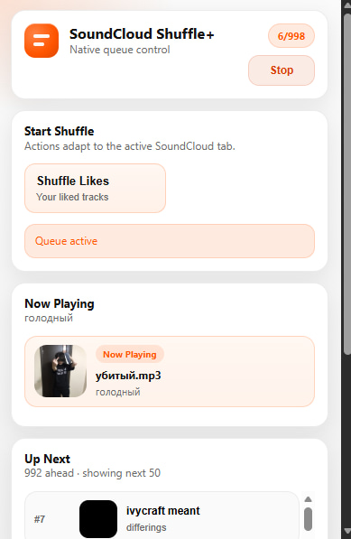

# SoundCloud True Shuffle Extension

**Are you tired of bad quality Soundcloud shuffle?**

Chrome/Edge extension that adds a real full-library shuffle to SoundCloud.

Instead of shuffling only the tracks currently rendered in the page, it fetches the full track set from SoundCloud's internal API, builds its own queue, and drives playback through the native SoundCloud player UI.

## Features

- Full shuffle for large SoundCloud collections.
- Context-aware shuffle:
  - Likes
  - Reposts
  - Tracks
  - Profile mix (tracks + reposts)
  - Single playlist
  - All playlists on a profile
- Native-style footer controls injected into SoundCloud:
  - Shuffle previous
  - Shuffle next
  - Stop shuffle
- Popup with:
  - page-aware shuffle actions,
  - `Now Playing`,
  - `Up Next` preview,
  - direct track selection from the queue.

## How It Works

1. The background service worker captures `client_id` from SoundCloud API traffic.
2. It uses SoundCloud internal endpoints to fetch the full track set for the selected context.
3. The extension builds and shuffles its own queue in the background.
4. The active SoundCloud tab is driven to the next queued track.
5. The popup shows the current item and the next upcoming queue entries.

The real playback queue stays inside the extension. SoundCloud remains the playback surface.

## Installation

1. Clone or download this repository.
2. Open `chrome://extensions/` or `edge://extensions/`.
3. Enable **Developer mode**.
4. Click **Load unpacked**.
5. Select the project root folder.

## Usage

### First Run

If the extension has not captured `client_id` yet:

1. Open SoundCloud.
2. Play any track for 1-2 seconds.
3. Start shuffle again.

### Starting Shuffle

You can start shuffle from:

- page buttons injected into SoundCloud,
- the extension popup.

### Queue Control

The popup shows:

- the current track,
- the next tracks that will play,
- direct click-to-play for any upcoming queue item.

Footer controls are injected beside SoundCloud's native transport buttons.

## Permissions

The extension uses:

- `storage`
- `cookies`
- `webRequest`
- `scripting`
- `webNavigation`

All traffic stays on SoundCloud domains. No external telemetry is added by the extension.

## Limitations

- SoundCloud is a fast-changing SPA, so selectors and playback behavior can change without notice.
- Very large collections can still hit rate limits on SoundCloud.
- Private `/you/*` flows require a logged-in SoundCloud session.
- Some transitions are still best-effort because SoundCloud's player state is not public API.

## Documentation

Technical architecture is documented here:

- [docs/ARCHITECTURE.md](docs/ARCHITECTURE.md)

## License

Apache License 2.0. See [LICENSE](LICENSE).

## Disclaimer

This project is not affiliated with SoundCloud.

It depends on internal SoundCloud behavior that may change at any time.
